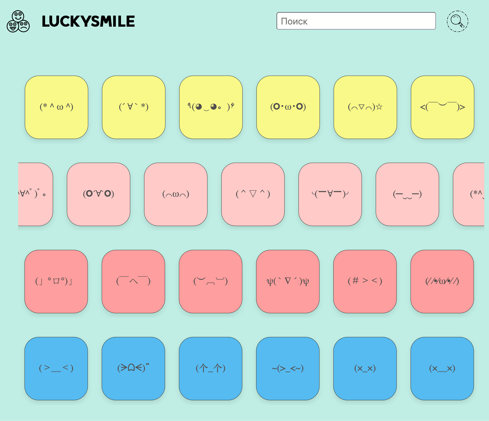

# LUCKYSMILE

**Простой сборник ASCII-смайликов для копирования**  
Сделан для тех, кто хочет быстро найти и скопировать забавный смайлик из символов.

## Что это?

Одностраничный сайт, на котором вы видите коллекцию текстовых смайликов для копирования.

## Как пользоваться

1. Откройте `index.html` в любом браузере.
2. Нажмите на понравившийся смайлик.
3. Вставьте скопированный смайлик туда, где нужно: в чат, пост, документ, код.

## Технологии

- HTML5
- CSS
- JavaScript для удобства копирования
